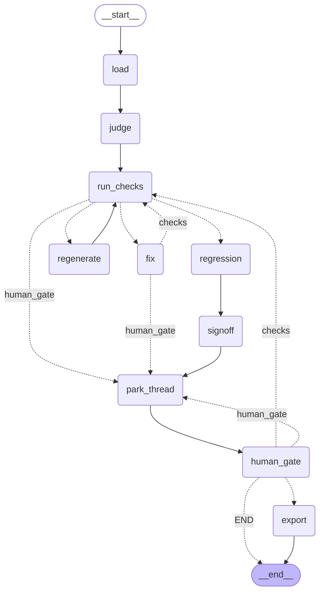

# PIPELINE.md — Lesson-Builder LangGraph Pipeline Wiki

> **Status:** authoritative wiki for the lesson-build/QA pipeline as it exists in `src/lesson_builder/`.
> Each surface carries a **live / stub / absent** status so a reader can tell what actually runs vs.
> what is a deterministic placeholder. Derived from the code (file:line cited), not from the older
> plan docs. When code and a plan doc disagree, the code wins and this file records the code.

---

## 1. What this pipeline is

A **lesson quality-assurance and export pipeline** for Norwegian (Bokmål) lessons. Its job: take a
lesson aggregate (objectives + teaching sections + exercises + review pool), run it through
deterministic gates and advisory LLM review, repair blocking issues with an author LLM, park for a
human decision, and on accept export a validated artifact to `dist/lessons/<slug>.json` plus an
acceptance-ledger entry.

The architecture is a **LangGraph `StateGraph`** with strict dependency-injection discipline: every
node is a pure function of `(LessonQAState, GraphDeps)`. All IO and LLM work happens inside injected
collaborators (`loader`, `fixer`, `judge`, `exporter`), never inline in a node. This keeps the graph
testable offline (inject fakes) and swappable in production (inject live LLM surfaces).

There are **three flows**:

| Flow | Entry | Purpose | Produces |
|------|-------|---------|----------|
| **Curriculum** | `lesson-data curriculum <text>` | Draft/commit curriculum requirements | `data/concept_requirements/<slug>.json` |
| **Improvement** (front-half) | `lesson-data improve <text>` | Modify an existing lesson, then hand to QA | a draft lesson → QA back-half |
| **Lesson-QA** (back-half graph) | `lesson-data graph run <slug>` | Gate → judge → repair → human → export | `dist/lessons/<slug>.json` + ledger entry |

The QA back-half is the spine; the improvement flow feeds a draft into it.

---

## 2. CLI surface (`cli.py`, `pipeline/cli.py`)

| Command | Function | Status |
|---------|----------|--------|
| `lesson validate --require-files …` | Pydantic-validate a lesson/export JSON file | **live** |
| `graph run <slug> [--commit] [--fixer codex] [--judge real]` | Start a QA run; parks at human gate | **live** |
| `graph show <slug> --run-id …  [--full]` | Print a parked/terminal thread state | **live** |
| `graph resume <slug> --run-id … --decision accept\|edit\|defer [--override]` | Resume a parked thread | **live** |
| `graph list` | Enumerate parked threads | **live** |
| `improve <text> [--slug] [--add-exercise] [--bloom] [--count] [--commit]` | Improvement front-half → QA back-half | **live** |
| `author <slug> [--commit] [--force] [--fixer codex] [--judge real]` | Cold-author a lesson from requirements; parks at human gate | **live (with caveats — see §9)** |
| `chat` | Conversational REPL over the QA/improvement flows (see §2.1) | **live** |
| `import <file> [--slug] [--status …] [--commit]` / `regenerate-dist` | Import an external lesson (J2) or regenerate dist from data | **live — see §13** |
| `curriculum <text> [--commit-draft DIR]` | Draft or commit curriculum requirements | **partial — see §7** |
| `ledger mark-unverified <slug> --reason …` | Demote a regression baseline | **live** |

**Scratch vs commit.** A bare `run`/`improve` writes artifacts under `store/scratch/` (gitignored) so
ad-hoc runs never dirty tracked `data/lessons/`, `dist/lessons/`, or
`data/lesson_acceptance_log.jsonl`. `--commit` redirects writes to the real tracked paths.

> **`noop` is not a CLI choice.** `--fixer`/`--judge` accept only the live registry
> entries (`codex` / `real`); the offline `noop_fixer`/`noop_judge` remain importable for
> test injection via `GraphDeps(fixer=…, judge=…)` but cannot be selected at the CLI (Task F).

### 2.1 Conversational + visual surfaces

Two operator surfaces sit **on top of** the CLI/graph for driving the pipeline in plain language
and inspecting it visually — both local-only, no network surface.

- **`lesson-data chat`** (`chat/repl.py` → `chat/controller.py`) — a terminal REPL where an LLM
  intent-router (gpt-5.5 via codex) turns natural language ("add an exercise to `<slug>`", "run QA",
  "accept the latest parked thread") into the bounded action set, executed through the same
  `run_improvement_flow` / `run_graph` / `resume_thread` entry points (so everything passes the same
  gates). Deterministic, no-LLM shortcuts: `show <slug>` renders a lesson's content (`chat/lesson_view.py`),
  `find <substr>` filters the lesson list, and `work on <slug>` selects a lesson without a billable call.
  Reach it over ssh; nothing is bound to a port.
- **`langgraph dev`** (entry `pipeline/graph_app.py:graph`, declared in `langgraph.json`) — serves the
  compiled Lesson-QA graph to LangGraph **Studio** for visual inspection of the topology and runs.
  Local by default (`127.0.0.1`); for a remote browser use `--tunnel` (Cloudflare https) rather than
  binding `0.0.0.0` (the https Studio UI blocks mixed-content to a plain-http LAN box).

---

## 3. The Lesson-QA graph topology (`lesson_qa_graph.py`)

Rendered directly from the compiled graph (`graph.get_graph().draw_mermaid()` — reproducible, not
hand-drawn). Solid edges are unconditional; dotted edges are conditional routing.



ASCII fallback:

```
START
  │
  ▼
load ──► judge ──► run_checks ──[route_after_aggregate]──┐
                        ▲                                 │
                        │            no blocking ─────────┼──► regression ──► signoff ──► park_thread
                        │            blocking, fixes left ┼──► fix ──[route_after_fix]──► run_checks | park_thread
                        │            blocking, regen left ┼──► regenerate ──► run_checks
                        │            budget exhausted ────┴──► park_thread
                        │
                   (re-check)                       park_thread ──► human_gate (INTERRUPT)
                        │                                               │
                        └───────────────────────────[route_after_human]┤
                                                     accept  ──► export ──► END
                                                     edit    ──► run_checks (re-validate edit)
                                                     defer   ──► END (stays parked)
```

Compiled by `build_lesson_qa_graph(deps, checkpointer)` (`lesson_qa_graph.py:389`). A SQLite
checkpointer enables park/resume at the human interrupt; without one the graph still runs but cannot
park.

---

## 4. Nodes (each a pure `(state, deps) -> partial-state-update`)

### 4.1 `load_node` (`:152`) — **live**
Calls `deps.loader(slug, repo_root)`. The default loader (`default_loader`, `:360`) reads
`data/lessons/<slug>.json`, resolves `data/concept_requirements/<slug>.json`, and resolves the latest
trusted regression baseline + its `requirements_hash` from the acceptance ledger. Returns the lesson,
requirements, baseline, and recorded hash into state. Sets `park_status="running"`.
**Requires the lesson to already exist** — `FileNotFoundError` otherwise. (This is the cold-start hole; see §9.)

### 4.2 `judge_node` (`:166`) — **live by default**
Calls `deps.judge(lesson)` **once** on entry. The default panel (`default_judge`, `judges.py:67`) runs
three `reviewer()`-backed producers and fills the review keys:
- `pedagogy_review` → `PedagogyReview` (7 rubric axes 0–5 incl. `bokmal`, plus P0–P3 issues)
- `objective_alignment_review` → `ObjectiveAlignmentReview` (semantic exercise↔objective alignment)
- `answer_review` → `AnswerReview` (reviewer's *own* blinded answers, compared to the lesson key)

Does **not** re-run inside the fix/regenerate loop or on human-edit re-entry (cost + advisory
findings don't drive the deterministic loop). The payloads are carried in state and re-folded by every
`run_checks` pass. `K_DEFAULT_JUDGE="real"` (`graph_runner.py:57`); `noop_judge` produces all-None for
offline/test.

### 4.3 `run_checks_node` (`:185`) — **live**
Runs the **deterministic gate** (`gate_lesson_results`) then folds the **advisory** review payloads
(`gate_advisory_results`). Overwrites `current_issues` each pass; appends to `issue_history` (audit).
The router reads only `current_issues`. See §5 for the check inventory.

### 4.4 `fix_node` (`:212`) — **live by default**
Filters to blocking issues, calls `deps.fixer(slug, lesson, issues, kind="fix")`. The default fixer
(`author_fixer`, `fixers.py:62`) builds a repair prompt (full lesson + issues + fix hints), calls
`author().structured(Lesson).invoke(prompt)` (structured output validated against the `Lesson`
schema), and returns the corrected lesson. On a known LLM failure (backend down / quota / parse) it
returns the **original lesson unchanged**, so the convergence guard escalates to a human.
`K_DEFAULT_FIXER="codex"` (`graph_runner.py:49`). Records an `AttemptRecord` (hash before/after +
blocking fingerprint).

### 4.5 `regenerate_node` (`:230`) — **live by default**
Same as `fix_node` but `kind="regenerate"`, used after the fix budget is exhausted. Capped separately.

### 4.6 `regression_node` (`:248`) — **live**
Re-runs `regression_check` on the final lesson vs the trusted baseline and stores a **structured
verdict** (`blocking_passed` / `has_warnings` / `severity` / `diff` / `reason`). Regression is
**non-blocking by design** — it only ever emits warnings, so `blocking_passed` is always `True`. The
verdict surfaces a real diff to the human instead of reading as "no change".

### 4.7 `signoff_node` (`:293`) — **live (derived)**
If a `pedagogy_review` is present, computes `signoff_score = pedagogy_percent(review)` (0–100 over the
7 axes). Otherwise `None`. Advisory; human review is still the decision point.

### 4.8 `park_thread_node` (`:487`) — **live**
Sets `park_status="parked"` immediately before the interrupting node.

### 4.9 `human_gate_node` (`:306`) — **live**
Calls LangGraph `interrupt(payload)`. The payload (`_human_interrupt_payload`, `:454`) carries the
blocking issues, advisory issues, regression verdict, signoff score, and attempt ledger. Resumes via
`Command(resume=decision)` where decision is `{status: accept|edit|defer, lesson?, override?}`.

### 4.10 `export_node` (`:313`) — **live**
Reached only when `route_after_human` admits an accept. Calls `deps.exporter` (`default_exporter` in
`lesson_persistence.py`) to write the internal lesson + dist export + ledger entry. Sets
`ledger_status` to `accepted` or, when the human used `--override` past remaining blockers,
`accepted_override` (excluded from regression baselines). Returns `export_path`.

---

## 5. The check inventory (`checks/`)

### 5.1 Deterministic gate (`gate_lesson_results`, `gate_manager.py:44`) — all **live**
Runs in order; `schema_validate` short-circuits the rest on failure:
1. `schema_validate` — Pydantic `Lesson` validation (short-circuits)
2. `exercise_structural_checks` — per-operation payload structural integrity
3. `objective_structural_check` — objective cardinality / structure
4. `bloom_alignment_check` — exercise Bloom level vs objective
5. `nynorsk_check` — flags Nynorsk leakage into a Bokmål lesson
6. `requirement_anchors_check` — lesson covers the concept's required anchors
7. `regression_check` — diff vs trusted baseline (warning-only)
8. `stale_check` — requirements hash drift

> **Note:** the former `ordbokene_oracle_check` (deterministic dictionary fabrication gate) was
> **removed**; Bokmål-inflection correctness is now owned by the pedagogy reviewer's `bokmal` axis
> (advisory). See §8.

### 5.2 LLM judges (`gate_advisory_results`, `gate_manager.py:73`) — **live; two finding kinds**
Each present review payload is mapped to `CheckResult`s:
- `pedagogy_check_from_review` (pedagogy issues) — **advisory** (log-only)
- `objective_alignment_check_from_review` (alignment issues) — **advisory**
- `answer_valid_check` (answer key vs reviewer's blinded answers) — **advisory**
- `rubric_floor_check` (pedagogy **scores** vs golden floors) — **load-bearing when promoted**

Issue-list findings are never promoted: calibration showed they over-flag (recall ~1.0, precision
~0.25). The load-bearing LLM layer is the rubric-floor check over the reviewer's 7-axis **scores**
(stable: goldens 94-100%). See §8.

---

## 6. The improvement flow (`improvement_flow.py`, `improvement_steps/`)

Front-half that produces a draft and feeds the QA back-half:

1. `parse_request` (`improvement_steps/parse_request.py`) → `ImprovementSpec` (operation, target slug, confidence) — **live (deterministic parse)**
2. `LessonIndex.hydrate` (`store/index.py`) → retrieval context over `data/lessons/` — **live**
3. `triage_request` (`improvement_steps/triage.py`) → re-routes low-confidence/off-scope requests — **live**
4. `feasibility_check` (`improvement_steps/feasibility.py`) → `feasible | infeasible | off_scope` — **live**
5. Author the draft by operation:
   - `add_exercises` (`improvement_steps/add_exercises.py`) — **live author** via `construct_payload` + `call_with_validation` (the public `build_validated_exercise` helper)
   - `add_explanation` (`improvement_steps/add_explanation.py`) — **live author**
   - `improve` → **live** whole-lesson revise author (`improvement_steps/revise_lesson.py`, Task D)
   - any other op → `needs_human` ("not auto-authored yet")
6. `_run_back_half` → feeds the draft into `run_graph` via a one-shot loader with the **live registry defaults** (`fixer_name="codex"`, `judge_name="real"`); `noop` overrides keep tests offline.

### Status
Tasks A + B + D landed. The improvement back-half now inherits the same live fixer + judge defaults as
`graph run`, `add_exercises` validates author output through the flat contract + the Lesson element
schema with bounded retry (a malformed response surfaces as `AddExercisesError`, never a silent drop),
and `improve` drives a whole-lesson revise author (`revise_lesson`) that returns a structured `Lesson`.
`build_validated_exercise` is the shared helper used by both the improvement-flow author and the
cold-author exercise stage (§9).

---

## 7. The curriculum flow (`curriculum/` → `curriculum_design/increment.py`) — **partial**

`run_increment` proposes a slug and drafts/derives `concept_requirements` for it;
`commit_increment_draft` copies an approved draft's requirements into
`data/concept_requirements/<slug>.json`. It produces **requirements only** — objectives/anchors for a
concept — **not a full lesson** (no teaching sections, no exercises, no review pool). The step that
turns committed requirements into an initial lesson does not exist (see §9).

> **Deliberate scope cut.** Curriculum authoring is intentionally deferred: the project's focus is
> the **QA / repair / calibration** half of the pipeline (the part that demonstrates LLM-as-component
> guardrails). Cold authoring from requirements is covered by the `cold_author/` journey (§9); the
> curriculum *designer* (deciding which concepts a course should contain) is a separate problem not
> in scope here. Documented as partial rather than hidden so the seam is visible.

---

## 8. Calibration — rubric floors (`calibration/rubric_floors.py` + `rubric_run.py`) — **live, load-bearing when promoted**

The LLM gate is calibrated **corpus-free**: `rubric_run.py` scores the 5 golden lessons with the live
reviewer (`pedagogy_review`), and `compute_rubric_floors` sets a per-axis FLOOR = the goldens' per-axis
minimum minus a `floor_tolerance` (default 1, so the gate catches quality *collapse*, not a 1-point
dip). `rubric_floor_check` (folded in `gate_advisory_results`) flags any lesson scoring below a floor;
findings block only when `data/calibration/rubric_floors.json` carries `load_bearing: true` (set by
`rubric_run --promote`). Reviewer backend is **Z.AI GLM** (`zai/glm-5.2`, Anthropic-compatible) first,
then opencode/openrouter/codex fallbacks.

Why scores, not issue detection: a seeded-defect f1 harness (removed) showed the reviewer's **issue
lists** over-flag (recall ~1.0, precision ~0.25 — they flag clean goldens), while its **scores** are
stable and discriminative (goldens 94-100%). So issue-list findings stay advisory and the scores carry
the load-bearing gate. The deterministic gate (§5.1) remains the hard correctness layer; rubric floors
catch broad quality regressions; humans arbitrate nuance at the HITL gate. See the
`project_calibration_corpus_mismatch` memory for the full rationale.

---

## 9. The "nothing → dist" chain (cold-start readiness)

| Link | Status | Where |
|------|--------|-------|
| curriculum text → requirements | ✅ live (drafts requirements) | `curriculum_design/increment.py` |
| requirements → **initial full lesson** (objectives + sections + exercises + review pool) | ✅ **live** | `cold_author/flow.py` (Task E) |
| existing lesson → QA loop → dist | ✅ live (judge + fix + export all default-live) | `lesson_qa_graph.py` |

### 9a. Cold authoring (`cold_author/`, Task E) — **live**

`cold_author_flow(slug)` is the Journey 1 entry point: produce a draft `Lesson` from
`data/concept_requirements/<slug>.json` and park it at the shared human gate. It runs four staged
LLM calls, then feeds the assembled draft into `run_graph` via a **standalone loader** (not
`default_loader`, which would raise `FileNotFoundError` on a cold slug):

1. `author_metadata_objectives` — title, goal, CEFR level, objectives with Python-assigned ids.
2. `author_sections` — teaching sections covering every objective (real role literals; no `teach`).
3. `author_exercises` — >= 2 valid exercises per objective, ops from `eligible_operations`, bloom
   levels from each objective's targets (reuses `build_validated_exercise`).
4. `assemble_lesson` — deterministic assembly: review pool, `grounding_mode="fallback_no_wiki"`,
   anchor injection (so `requirement_anchors_check` passes by construction), objective-coverage
   assert, `Lesson.model_validate`, then a **full `gate_lesson_results` preflight = 0 blockers**.

Each stage returns `StageOK | StageFailure`; a mid-chain backend-down short-circuits to
`needs_human` and preserves earlier output as a draft (R4). `cold_author_flow` **refuses** when
`data/lessons/<slug>.json` already exists unless `--force` (cold-author is for slugs with
requirements but no lesson; use `improve` otherwise — R3). CLI: `lesson-data author <slug>`.

The 104 lessons in `data/lessons/` were authored by older `scripts/phase1_*.py` generators that were
**archived** (lean-v1 cleanup). The phase-2 rebuild reconstructed the QA/export chassis; cold
authoring is now reachable via Task E.

---

## 10. State, routing, budgets

**State** (`state.py:48`, `LessonQAState` TypedDict, blob-in-state): `slug`, `run_id`, `requirements`,
`baseline`, `recorded_requirements_hash`, `lesson`, `current_issues` (router reads this),
`issue_history` (append-only), `attempts` (typed retry ledger), the three review payloads,
`signoff_score`, `regression_result`, `park_status`, `human_decision`, `ledger_status`,
`export_path`, `repo_root`, `acceptance_log_path`, `output_root`.

**Routers** (pure functions):
- `route_after_aggregate` (`:125`): blocking? → `fix` if `fixes_used < K_GRAPH_MAX_FIXES (2)`, else
  `regenerate` if `regenerates_used < K_GRAPH_MAX_REGENERATES (1)`, else `human_gate`. No blocking →
  `regression`. Advisory blockers never route.
- `route_after_fix` (`:143`): re-enter `checks` unless the fix **stalled** — same lesson hash
  before/after, or a repeated blocking fingerprint — then `human_gate` (`convergence_failure`).
- `route_after_human` (`:169`): `accept` → `export` (re-parks if load-bearing blockers remain and no
  `override`); `edit` → `checks`; `defer`/respond → `END`.

**Budgets** (`state.py:32`): `K_GRAPH_MAX_FIXES=2`, `K_GRAPH_MAX_REGENERATES=1`,
`K_GRAPH_MAX_SIGNOFF_RETRIES=1`. **Convergence guard**: `blocking_fingerprint` + `lesson_hash` detect
a stuck loop and escalate to human rather than burning the budget on no-progress fixes.

---

## 11. Collaborators (DI seams) & their default status

| Seam | Protocol | Default | Status |
|------|----------|---------|--------|
| `loader` | `LessonLoader` | `default_loader` | **live** (reads `data/lessons/`) |
| `judge` | `Judge` | `default_judge` (`real`) | **live** reviewer panel; `noop` available |
| `fixer` | `Fixer` | `author_fixer` (`codex`) | **live** author repair; `noop` available |
| `exporter` | `Exporter` | `default_exporter` | **live** (internal + dist + ledger write) |

> `graph run` and the improvement back-half both use these registry defaults (live). The improvement
> back-half (`_run_back_half`) resolves `K_FIXERS["codex"]` / `K_JUDGES["real"]` explicitly and passes
> them through `GraphDeps(loader=…, fixer=…, judge=…)`; `noop` overrides keep unit tests offline.

---

## 12. Live-vs-Stubbed ledger (the single source of truth for "what actually runs")

| # | Surface | State | Evidence | Flip-to-live task |
|---|---------|-------|----------|-------------------|
| 1 | QA loader | **live** | `default_loader` | — |
| 2 | Pedagogy/alignment/answer judges (`graph run`) | **live** | `K_DEFAULT_JUDGE="real"` | — |
| 3 | Fix/regenerate author repair (`graph run`) | **live** | `K_DEFAULT_FIXER="codex"` | — |
| 4 | Export + ledger | **live** | `default_exporter` | — |
| 5 | Deterministic gate (8 checks) | **live** | `gate_lesson_results` | — |
| 6 | `improve` judging + repair | **live** | `_run_back_half` passes live `fixer`/`judge` | — |
| 7 | `add_exercises` payload validation/retry | **live** | `build_validated_exercise` + `call_with_validation` | — |
| 8 | `improve` whole-lesson revise | **live** | `improvement_steps/revise_lesson.py` (structured `Lesson` output, spec-driven) | — |
| 9 | Calibration → load-bearing gate | **live (rubric floors, promoted)** | `calibration/rubric_floors.py` + `rubric_run.py`; floors gate pedagogy scores, `load_bearing: true` | issue-list f1 harness removed (over-flagged); scores carry the gate |
| 10 | **Cold author** (requirements → initial lesson) | **live** | `cold_author/flow.py` (staged authoring + shared back-half) | — |
| 11 | **Import** (external lesson → data + ledger; dist derived separately) | **live** | `lesson_import.py::import_lesson` / `regenerate_dist` (Task F) | — |

Rows 6–11 all landed (Tasks A, B, C, D, E, F). No open ledger rows remain.

---

## 13. The import journey (`lesson_import.py`, Task F) — **live**

Journey 2: bring an externally-authored lesson into the repo so it can be improved/QA'd to `dist`.

- **`import_lesson(file, ...)`** — validate the file as an internal `Lesson`, then write
  `data/lessons/<slug>.json` + a ledger entry. Status defaults to **`imported_unverified`** so an
  external lesson does **not** silently become a trusted regression baseline; the human gate (and a
  later `graph run` accept) promotes it. CLI: `lesson-data import <file> [--slug] [--status …] [--commit]`.
- **`regenerate_dist(root)`** — bulk derive `dist/lessons/*.json` FROM `data/lessons/*.json` via
  `lesson_to_export`. Idempotent. CLI: `lesson-data regenerate-dist`.
- Recovery is git over `data/lessons/` (+ `data/concept_requirements/`). `dist/` is a derived serving
  projection, not an authoring recovery source. **Goldens are NOT an import source** — they are
  calibration fixtures only; the legacy bootstrap was one-time history.

Import is driven entirely through the `lesson-data import` CLI over `lesson_import.py`. After import,
Journey 3 takes over: `improve --slug <slug>` / `graph run <slug>` already work on a registered lesson.

---

## 14. Checking hand-edited lessons (`scripts/check_lessons.py`)

Hand-edits to `data/lessons/*.json` bypass the QA graph, so they can introduce blocking gate
defects or leave `dist/lessons/<slug>.json` stale without anyone noticing. Run
`uv run python scripts/check_lessons.py` before committing lesson edits: it targets lessons changed
vs the merge-base with master (or pass explicit paths, or `--all` for the full corpus), re-runs
`gate_lesson_results` for each, and verifies the on-disk dist matches a freshly computed
`lesson_to_export` projection. It exits non-zero on any blocking gate result or stale/missing dist
and prints a per-lesson report + summary line.
